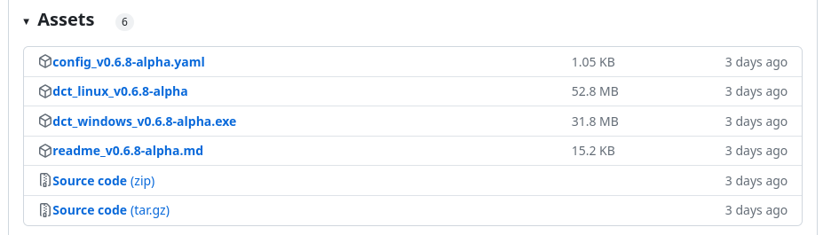
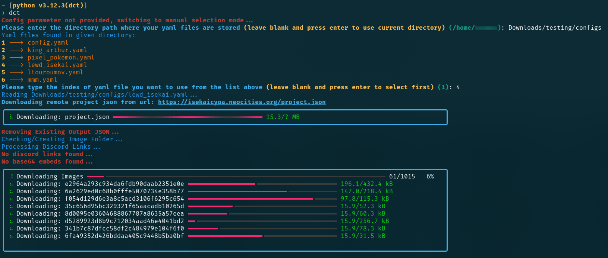

# dct (delicate cyoa tools)

`dct` is a Python package designed for processing ICC JSON files in a variety of ways.

> [!NOTE]
> To use `dct`, you need to provide a configuration YAML file.
> Sample config.yaml with all parameters with sample values: [config.yaml](config.yaml).
> There is also a sample config with all parameters that you can copy in config example section.

> [!IMPORTANT]
> See the [Configuration Parameters](#configuration-parameters) and [Config Examples](#config-examples-non-exhaustive-list) sections below to get detailed explanations.

> [!TIP]
> 

## Table of Contents

<details open>
<summary> Expand Section </summary>

1. [Downloading `dct` without Installing](#downloading-dct-without-installing)
2. [Installing](#installing)
3. [Configuration Parameters](#configuration-parameters)
4. [Config Examples (non-exhaustive list)](#config-examples-non-exhaustive-list)
5. [Screenshots](#screenshots)

</details>

## Downloading `dct` without Installing

Download the corresponding executable for you platform from [Latest Github Release](https://github.com/DelicateIntegral/dct/releases/latest)

<details>
<summary> Windows </summary>

- Go to the above release link.
- Check the Assets section (example screenshot of `v0.6.8-aplha` release):

- Grab the `dct_windows_{tag}.exe` file.
- Also grab the yaml and readme files as they would have the correct config parameters and their info matching that release version.
- Create a yaml file (for eg: `delicateworm.yaml`).
- Copy the parameters from the yaml you downloaded into this new one.
- Enable the parameters that you want to change, give them suitable values (read `readme`).
- Run the program. Give the path where your yaml files are stored. Select the yaml that you want to use.

> [!WARNING]
> Make sure you give double `\\` in paths instead of single `\` if you are changing `INPUT_DIRECTORY` or `OUTPUT_DIRECTORY` in the configuration files.
> Correct: `D:\\my awesome folder\\subfolder of downloads\\cyoa tools`
> Incorrect: `D:\my awesome folder\subfolder of downloads\cyoa tools`

</details>

<details>
<summary> Linux </summary>

- Go to the above release link.
- Check the Assets section (example screenshot of `v0.6.8-aplha` release):

- Grab the binary file `dct_linux_{tag}`.
- Also grab the yaml and readme files as they would have the correct config parameters and their info matching that release.
- Create a yaml file (for eg: `delicateworm.yaml`).
- Copy the parameters from the yaml you downloaded into this new one.
- Enable the parameters that you want to change, give them suitable values (read `readme`).
- Run the program. Give the path where your yaml files are stored. Select the yaml that you want to use.

> [!WARNING]
> Binaries/scripts many times are not executable in linux due to insufficient permission. Run this command to give executing permission to binary:
>
>    ```bash
>    chmod +x path/to/the/downloaded/dct_linux_{tag}
>    ```
> After doing this you can run the binary with this command in terminal:
>
>    ```bash
>    ./dct_linux_{tag}
>    ```

</details>

## Installing

<details>
<summary> Expand Section </summary>

As `dct` is a python package that uses poetry for package build/dependency/install, you can easily install it yourself by cloning the repo and running the commands below.

**Requirements for installing : Python 3.12 or higher, Git (for cloning, or you can download the repo manually), poetry (for installing the package and its dependencies).**

```bash
git clone https://github.com/DelicateIntegral/dct.git
cd dct
poetry install
```

**As pip can directly install a project with pyproject.toml since the release of pip version 21.3, which supports PEP 660, you can also do the following to install `dct`:**

```bash
git clone https://github.com/DelicateIntegral/dct.git
pip install dct/.
```

**OR if you don't want to clone repo separately first, just install with pip directly like this (you still need git installed):**

```bash
# general format : pip install git+https://github.com/DelicateIntegral/dct.git@[branch or release tag]
pip install git+https://github.com/DelicateIntegral/dct.git@v0.6.7
```

The above command clones the git repo to temp location, checkouts the tag (branch if branch name given instead of tag name like above) and then installs the dependencies and `dct`.

**Note: It is recommended to create virtual environment and install the package in that to not effect or mess up the global python in your system. You can search the internet on how to create venv and activate it or see it in the install scripts (mentioned below) before using installation methods command.**

### Installing with scripts

To make the install process easier and also create launch script with desktop shortcuts, there are install scripts present in the repo.

Windows: [install.bat](install.bat)

Linux: [install.sh](install.sh)

Script will ask you to enter the `Install_Path` and will do this steps if path provided is valid and exists:

1. It will create a venv named `cyoaenv` in `%USERPROFILE%\python\env\` for windows OR `$HOME/python/env/` for linux, and activate this environment
2. It will run the `poetry install` command
3. It will create launch script named `launch-dct.bat` (for windows) OR `launch-dct.sh` (for linux) in path: `INSTALL_PATH/dct`.
4. It will then create desktop shortcut and start menu shortcut for this launch script.

### Building binaries

**If you are insterested in building the binaries yourself, you can check the [build.yml](.github/workflows/build.yml) that is used in Github Actions to generate binaries.**

**NOTE: It is recommended to install the package with poetry or install script as `pyinstaller` can behave or give errors in different environments.**

</details>

## Configuration Parameters

<details>
<summary> Expand Section </summary>

**Below listed are the valid parameters that you can define in the config file.**

**Details about parameters:**

- **`INPUT_DIRECTORY`**: Optional.The directory path where the JSON file (`PROJECT_FILE`) is stored. Default is current working directory which the tool calculates programtically if this config option is disabled or not given.
- **`OUTPUT_DIRECTORY`**: Optional.The directory path where the output JSON (`OUTPUT_FILE`) will be stored, and where the `IMAGE_FOLDER` for downloaded images will reside. Default is current working directory which the tool calculates programtically if this config option is disabled or not given.
- **`PROCESS_DISCORD_LINKS`**: Optional. If set to `True`, it will process Discord links present in the JSON. Default is `False`. If `DOWNLOAD_IMAGES` is `True`, it will download images to `IMAGE_FOLDER` and update links like this: `IMAGE_FOLDER/image_name`. Otherwise, it will just refresh URLs and replace old ones.
- **`TOKEN`**: Optional but required if `PROCESS_DISCORD_LINKS` is `True`. Default is `YOUR TOKEN`. Your Discord bot token required for authentication with Discord's API.
- **`PROJECT_FILE`**: Optional. Default is `project.json`. The name of the input ICC JSON file containing Discord links.
- **`OUTPUT_FILE`**: Optional. Default is `project_new.json`. The name of the output JSON file where updated ICC JSON data will be saved.
- **`IMAGE_FOLDER`**: Optional. Default is `images`. The name of the folder where downloaded images will be stored.
- **`CONVERT_IMAGES`**: Optional. Default is `False`.
- **`IMAGE_QUALITY`**: Optional. Default is `90`. The image quality of the webp images saved in `IMAGE_FOLDER`. Value between 0-100. **`CONVERT_IMAGES` should be `True` for this to be taken into account.**
- **`IMAGE_FORMAT`**: Optional. Default is `WEBP`. **`CONVERT_IMAGES` should be `True` for this to be taken into account.**
- **`UPDATE_PREFIXES`**: Optional. Default is `False`. If set to `True`, it will update image URLs by replacing `OLD_PREFIX` with `NEW_PREFIX`. Helpful if you have some folder of images in a server with constant prefix and you moved that folder to another server.
- **`OLD_PREFIX`**: Optional. Default is `""`. The old prefix to replace in image URLs. When it is not blank, only those urls which contain the `OLD_PREFIX` are changed to `NEW_PREFIX`.
- **`NEW_PREFIX`**: Optional. Default is `""`. The new prefix to prepend to updated image URLs. Leave blank if you are uploading `IMAGE_FOLDER` to Neocities or GitHub in the same directory as `index.html`.
- **`MINIFY`**: Optional. Default is `False`. Set to `True` to minify the output JSON file.
- **`RATE_LIMIT`**: Optional. Default is `2`. The maximum number of concurrent requests allowed for Discord URL refresh operations. Recommended to skip this option in the config and leave it at default value.
- **`BASE64_TO_IMAGE`**: Optional. Default is `False`. If set to `True`, it will process base64 encoded images in the JSON, converting them to webp and storing to `IMAGE_FOLDER` and updating links like this: `IMAGE_FOLDER/image_name`. You can provide `NEW_PREFIX` and set `UPDATE_PREFIXES` to `True` to update links to this: `NEW_PREFIX/IMAGE_FOLDER/image_name`.
- **`DOWNLOAD_IMAGES`**: Optional. Default is `False`. If set to `True`, it will download images linked in the JSON to `IMAGE_FOLDER` and updating links like this: `IMAGE_FOLDER/image_name`. You can provide `NEW_PREFIX` and set `UPDATE_PREFIXES` to `True` to update links to this: `NEW_PREFIX/IMAGE_FOLDER/image_name`.
- **`OVERWRITE_IMAGES`**: Optional. Default is `False`. If set to `True`, it will overwrite existing images in `IMAGE_FOLDER` otherwise skip pre-existing webp images.
- **`DISABLE_IMAGES`**: Optional. Default is `False`. If set to `True`, it will disable all images in "image" (backgrounds etc are not affected) in the JSON and exit.
- **`DOWNLOAD_RATE_LIMIT`**: Optional. Default is `5`. The maximum number of concurrent requests allowed when downloading images. Recommended to keep below `10`.
- **`IMAGE_TO_BASE64`**: Optional. Default is `False`. If set to `True`, it will scan the `IMAGE_FOLDER` for images and convert them to base64 and add them to the json only for those choice ids whose corresponding image is found.
- **`SHOW_CONFIG`**: Optional. Default is `False`. If set to `True`, it will show all the config parameters with their values which the program will be using.
- **`PROJECT_URL`**: Optional. Default is empty. If it is non-empty, the program will download the json file data and use it instead of `PROJECT_FILE`. **NOTE: You have to give full url with json file included in the url like this: `https://examplesitethatdoesnotexist.org/sldkfjlskjdf/lkjflskjflkj/mycyoa/customproject.json`**
- **`SESSION_TIMEOUT`**: Optional. Default value is `600`. This is amount of seconds for total session when downloading.
- **`LOG_FILE`**: Optional. Default value is `dct_log`. Name of the log file that is written in the `OUTPUT_DIRECTORY`.

### Priority order of parameters (decides which parameter is processed first)

1. `INPUT_DIRECTORY` and `OUTPUT_DIRECTORY` (The program continues after this.)
2. `PROJECT_FILE` or `PROJECT_URL` (The program continues after this.)
3. `OUTPUT_FILE` (The program continues after this.)
4. `DISABLES_IMAGES` (The program exits after processing this.)
5. `IMAGE_FOLDER` (The program continues after this.)
6. `PROCESS_DISCORD_LINKS` (Uses these parameters: `DOWNLOAD_IMAGES, TOKEN, OVERWRITE_IMAGES, RATE_LIMIT, IMAGE_FOLDER, IMAGE_QUALITY, DOWNLOAD_RATE_LIMIT, IMAGE_FORMAT, CONVERT_IMAGES`) (The program continues after this.)
   1. `TOKEN` (uses: `RATE_LIMIT`)
   2. `DOWNLOAD_IMAGES` (uses: `OVERWRITE_IMAGES, IMAGE_FOLDER, DOWNLOAD_RATE_LIMIT, CONVERT_IMAGES` (`CONVERT_IMAGES` uses `IMAGE_QUALITY, IMAGE_FORMAT`))
7. `BASE64_TO_IMAGE` (Uses these parameters: `IMAGE_FOLDER, IMAGE_QUALITY, OVERWRITE_IMAGES, IMAGE_FORMAT, CONVERT_IMAGES`) (The program continues after this.)
8. `DOWNLOAD_IMAGES` (This parameter is processed again as it downloads the other image urls that are not discord in this step. Uses these parameters: `IMAGE_QUALITY, IMAGE_FOLDER, OVERWRITE_IMAGES, DOWNLOAD_RATE_LIMIT, IMAGE_FORMAT, CONVERT_IMAGES`) (The program continues after this.)
9. `IMAGE_TO_BASE64` (Will be skipped if `BASE64_TO_IMAGE` is also on and will show you a warning while skipping. Uses these parameters: `IMAGE_FOLDER, OUTPUT_PATH, MINIFY`) (The program exits after processing this parameter, if it is skipped, the program continues.)
10. `UPDATE_PREFIXES` (Uses these parameters: `NEW_PREFIX, OLD_PREFIX`) (The program exits after processing this parameter.)
11. IF nothing left the program exits.

**This priority helps in deciding the combinations of tasks that you can do together. Any task combinations would work correctly if the parameters that exit the program are the lowest priority or if nothing left to do.**

## Config Examples (non-exhaustive list)

**Sample Config with all parameters**:

```yaml
# BELOW ALL PARAMETERS ARE IN ENABLED STATE
# COMMENT PARAMETERS (PUT # BEFORE THEM) TO DISABLE THEM
# IF YOU WANT PARAMETERS TO HAVE DEFAULT VALUES, KEEP THEM DISABLED

# Values in INPUT_DIRECTORY and OUTPUT_DIRECTORY are just placeholders, actual current working directory will only be calculated if you keep them disabled.

# -----------------CONFIGURATION PARAMETERS (TOTAL 25)----------------

INPUT_DIRECTORY: "Current Working Directory"
OUTPUT_DIRECTORY: "Current Working Directory"
PROCESS_DISCORD_LINKS: False
TOKEN: "YOUR TOKEN"
PROJECT_FILE: "project.json"
PROJECT_URL: ""
OUTPUT_FILE: "project_new.json"
IMAGE_FOLDER: "images"
CONVERT_IMAGES: False
IMAGE_QUALITY: 90
IMAGE_FORMAT: "WEBP"
UPDATE_PREFIXES: False
OLD_PREFIX: ""
NEW_PREFIX: ""
MINIFY: False
RATE_LIMIT: 2
BASE64_TO_IMAGE: False
DOWNLOAD_IMAGES: False
OVERWRITE_IMAGES: False
DISABLE_IMAGES: False
SHOW_CONFIG: False
DOWNLOAD_RATE_LIMIT: 5
IMAGE_TO_BASE64: False
SESSION_TIMEOUT: int = 600
LOG_FILE: str = "dct_log"
```

**Below are some config examples given for some of the tasks that `dct` can do:**

(All these examples don't have all parameters which indicates that the parameters that are not-defined/commented/disabled will automatically get default values)

1. You want to process discord urls so that the json has refreshed discord urls. Change the value of token with your actual BOT TOKEN. You can see this link to understand how to get discord BOT TOKEN: [Getting BOT TOKEN](https://discordgsm.com/guide/how-to-get-a-discord-bot-token)

   ```yaml
   PROCESS_DISCORD_LINKS: True
   TOKEN: "example discord bot token string"
   ```

2. You want to convert the urls (other than discord) to local links and download images in a folder with a custom name `CyoaImages` for the folder.

   ```yaml
   IMAGE_FOLDER: "CyoaImages"
   DOWNLOAD_IMAGES: True
   ```

3. You want to convert all urls (including discord) like in point 2.

   ```yaml
   PROCESS_DISCORD_LINKS: True
   TOKEN: "example discord bot token string"
   IMAGE_FOLDER: "CyoaImages"
   DOWNLOAD_IMAGES: True
   ```

4. You want to disable all images (base64, local linked, urls).

   ```yaml
   DISABLE_IMAGES: True
   ```

5. You want to convert base64 embedded images to local links and download them like in step 2.

   ```yaml
   IMAGE_FOLDER: "CyoaImages"
   BASE64_TO_IMAGE: True
   ```

6. You want to convert local links to new urls. Let's say you have folder `CyoaImages` in a server with url : `https://example.com/alsdkfjklsd/lksdfj/CyoaImages`.

   ```yaml
   NEW_PREFIX: "https://example.com/alsdkfjklsd/lksdfj/"
   UPDATE_PREFIXES: True
   ```

7. You already have urls in json but you want to move the image folder to new server.

   ```yaml
   OLD_PREFIX: "https://oldexample.com/oldalkdjfkajf/oldflakjdflkf/lsllk/"
   NEW_PREFIX: "https://example.com/alsdkfjklsd/lksdfj/"
   UPDATE_PREFIXES: True
   ```

**You can also combine some tasks with each other like below (see the Priority order in [Configuration Parameters](#configuration-parameters) to get idea on how to create valid combination of tasks):**

</details>

## Screenshots



**Note: Colors may vary due to terminal color settings.**
